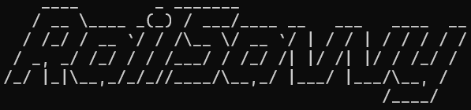

</b>
 

A command-line interface railway reservation management system using RDBMS databases. 

 

## About
> The project involves designing and maintaining a *simple, easy-to-use, easy-to-maintain* railways reservation management system, which facilitates the passengers to: 
> - book or cancel a train reservation,
> - make inquiries about the trains available based on source and destination, 
> - obtain status of their booked ticket, etc.

 

## Documentation
[Click here for documentation!](./documentation.md)
