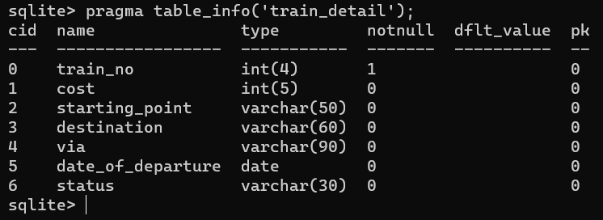
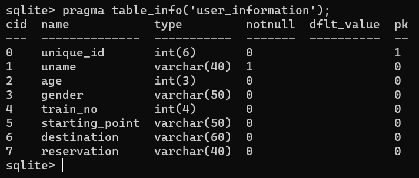
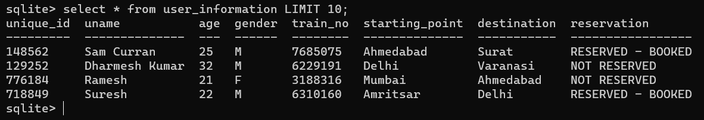

# DOCUMENTATION
Python acts as the front-end and SQLite is the database management system employed.
Python acts as the user interface and SQL, being able to handle large amounts of data, returns all the data requested by Python.

## SQLite
The name of the MySQL database is *‘projectTrain’*, which consists of two tables – *‘train_detail’* and *‘user_information’*.\

### *train_detail*
This table consists of 7 columns – 
`train_no` , `cost` , `starting_point` , `destination` , `via` , `date_of_departure` and `status`. \
 

Queried data from this table would look of the form:

### *user_information*
This table consists of 8 fields – 
`unique_id` , `uname` , `age` , `gender` , `train_no` , `starting_point`, `destination` and `reservation`. \

Queried data from this table would look of the form: 

 

## Python
#### **railsmenu()** 
>This function starts the program and provides the user with multiple options to choose from – check the details of any train based on starting point and destination, reserve or cancel a ticket, check the PNR (Passenger Name Record) of their reservation, etc. \
[A _return_ statement is used to exit from the program and a message saying, '' is printed when the user has exit from the program.]

#### **train_detail()** 
>This function asks the user about the starting point and destination of their preferred train and returns with the desirable trains satisfying the given conditions and the details of those trains. \
>We fetch the trains going from the specified starting point to destination by the following SQL command: \
`
SELECT * FROM train_detail WHERE starting_point="{start}" AND (destination="{end}" OR via="{end}");
`

#### **reservation()** 
>This function lets the user reserve their ticket. \
    – If the ticket is confirmed, then a message saying “Your seats are reserved” is shown and the user is given a unique ID, which refers to their ticket details. \
    – If the ticket is not confirmed, a message saying, “Your seats are not reserved” is displayed. 
\
>We take the train number from the user and we verify it to be the correct one via checking. The SQL command used to insert user credentials into the database is: \
`
INSERT INTO user_information (unique_id, uname, age, gender, train_no, starting_point, destination) VALUES ({uid}, "{name}", {age}, "{gender}", {trainNumber}, "{start}", "{end}");
`

#### **cancel()** 
>This function lets the user cancel their reservation with the help of the unique ID given to them, when they reserved their ticket. \
>We take the user's unique ID and verify it to be the correct one using their credentials. Then, the following SQL command is used to cancel their booking: \
`
UPDATE user_information SET reservation="NOT RESERVED" WHERE unique_id={uid};
`

#### **displayPNR()**
>This function displays the personal information and the train booked by the passenger(s) having the specified unique ID. \
>The user details are fetched by making a SQL query to the database to extract user details with the obtained unique ID, verified via checking.

 

## Using RailSavvy
- Clone the repository by the following command: `git clone https://github.com/steadyfall/RailSavvy.git`
- Run the following command: `python main.py` (Win) / `python3 main.py` (Linux/MacOS)